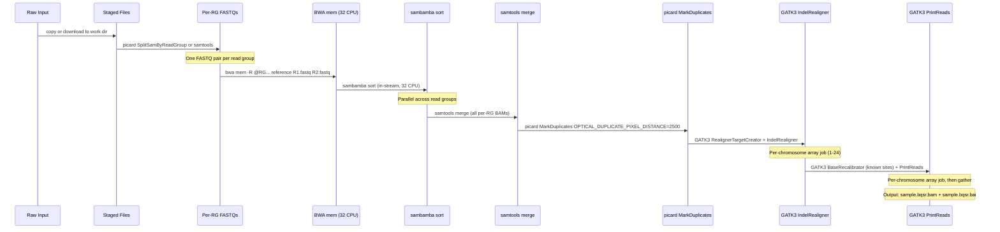
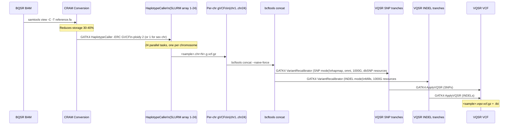
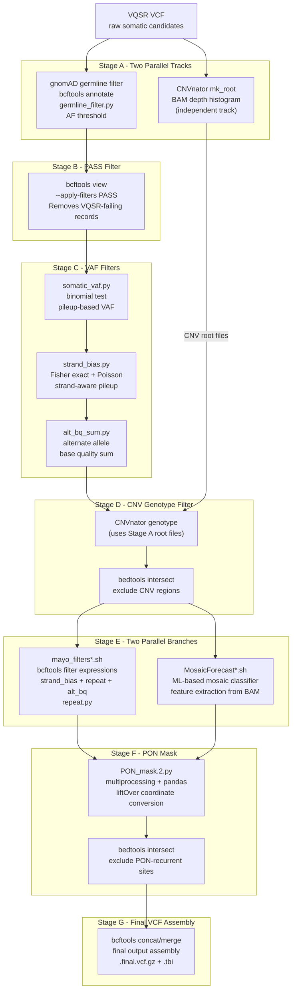
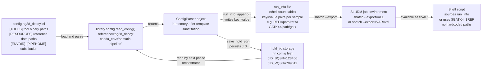

# Data Flow

## End-to-End Pipeline Data Flow

```mermaid
flowchart TD
    RAW(["Raw Input\nFASTQ / BAM / CRAM"])

    subgraph PHASE1["Phase 1 - Genome Mapping"]
        P1A["Stage Input\n(download or copy)"]
        P1B["Per-RG FASTQ\n(split by read group)"]
        P1C["Per-RG BAM (unsorted)\n(bwa mem)"]
        P1D["Per-RG BAM (sorted)\n(sambamba sort, 32 CPU)"]
        P1E["Merged BAM\n(samtools merge)"]
        P1F["Deduplicated BAM\n.dedup.bam\n(picard MarkDuplicates)"]
        P1G["Indel-Realigned BAM\n.realigned.bam\n(GATK3 IndelRealigner)"]
        P1H["BQSR BAM\n.bqsr.bam + .bai\n(GATK3 BaseRecalibrator + PrintReads)"]
        P1A --> P1B --> P1C --> P1D --> P1E --> P1F --> P1G --> P1H
    end

    subgraph PHASE2["Phase 2 - Variant Calling"]
        P2A["CRAM\n.cram + .crai\n(samtools view -C)"]
        P2B["Per-chromosome gVCF\n.g.vcf.gz\n(GATK4 HC array 1-24)"]
        P2C["Combined gVCF\n.combined.g.vcf.gz\n(bcftools concat)"]
        P2D["VQSR VCF\n.vqsr.vcf.gz\n(GATK4 VariantRecalibrator + ApplyVQSR)"]
        P2A --> P2B --> P2C --> P2D
    end

    subgraph PHASE3["Phase 3 - Variant Filtering"]
        P3A["gnomAD-filtered VCF\n.gnomad.vcf.gz\n(Stage A)"]
        P3B["PASS-only VCF\n.pass.vcf.gz\n(Stage B)"]
        P3C["VAF-filtered VCF\n.vaf.vcf.gz\n(Stage C)"]
        P3D["CNV-filtered VCF\n.cnv.vcf.gz\n(Stage D)"]
        P3E["Mayo-filtered VCF\n.mayo.vcf.gz\n(Stage E-branch1)"]
        P3F["Mosaic-classified VCF\n.mosaic.vcf.gz\n(Stage E-branch2)"]
        P3G["PON-masked VCF\n.pon.vcf.gz\n(Stage F)"]
        P3H["Final filtered VCF\n.final.vcf.gz + .tbi\n(Stage G)"]
        P3A --> P3B --> P3C --> P3D
        P3D --> P3E
        P3D --> P3F
        P3E --> P3G
        P3F --> P3G
        P3G --> P3H
    end

    FINAL(["Output\nFiltered Somatic Variants\n.final.vcf.gz + .tbi"])

    RAW --> P1A
    P1H -->|"hold_jid mechanism\nBAM also converted to CRAM"| P2A
    P2D -->|"hold_jid mechanism"| P3A
    P3H --> FINAL
```



---

## File Format Transformation Table

| Step | Input Format | Output Format | Tool | Intermediate Filename Pattern |
|---|---|---|---|---|
| Stage input | FASTQ / BAM | Staged FASTQ | cp / wget / samtools fastq | `<sample>.R1.fastq.gz` |
| Split by RG | Multi-RG FASTQ | Per-RG FASTQ | picard SplitSamByReadGroup | `<sample>.<rg>.R1.fastq.gz` |
| Alignment | FASTQ (paired) | Unsorted BAM | bwa mem | `<sample>.<rg>.bam` |
| Sort | Unsorted BAM | Sorted BAM | sambamba sort | `<sample>.<rg>.sorted.bam` |
| Merge | Multiple sorted BAMs | Merged BAM | samtools merge | `<sample>.merged.bam` |
| Mark duplicates | Merged BAM | Deduplicated BAM | picard MarkDuplicates | `<sample>.dedup.bam` |
| Indel realignment | Deduplicated BAM | Realigned BAM | GATK3 IndelRealigner | `<sample>.realigned.bam` |
| BQSR | Realigned BAM | Calibrated BAM | GATK3 BaseRecalibrator + PrintReads | `<sample>.bqsr.bam` |
| BAM to CRAM | BQSR BAM | CRAM | samtools view -C | `<sample>.cram` |
| Variant calling | CRAM | gVCF (per chr) | GATK4 HaplotypeCaller | `<sample>.chr<N>.g.vcf.gz` |
| gVCF concat | Per-chromosome gVCFs | Combined gVCF | bcftools concat | `<sample>.combined.g.vcf.gz` |
| VQSR | Combined gVCF | Recalibrated VCF | GATK4 VariantRecalibrator + ApplyVQSR | `<sample>.vqsr.vcf.gz` |
| gnomAD filter | VQSR VCF | Population-filtered VCF | bcftools + `germline_filter.py` | `<sample>.gnomad.vcf.gz` |
| PASS filter | gnomAD VCF | PASS-only VCF | bcftools view -f PASS | `<sample>.pass.vcf.gz` |
| VAF filters | PASS VCF | VAF-annotated VCF | `somatic_vaf.py`, `strand_bias.py`, `alt_bq_sum.py` | `<sample>.vaf.vcf.gz` |
| CNV filter | VAF VCF | CNV-excluded VCF | CNVnator + bedtools intersect | `<sample>.cnv.vcf.gz` |
| Mayo filters | CNV VCF | Expression-filtered VCF | bcftools filter (strand_bias, repeat, alt_bq) | `<sample>.mayo.vcf.gz` |
| MosaicForecast | CNV VCF | Mosaic-classified VCF | MosaicForecast ML pipeline | `<sample>.mosaic.vcf.gz` |
| PON mask | Mayo + Mosaic VCFs | PON-masked VCF | `PON_mask.2.py` + liftOver + bedtools | `<sample>.pon.vcf.gz` |
| Final output | PON VCF | Final filtered VCF | bcftools concat/merge | `<sample>.final.vcf.gz` |

---

## Phase 1 Detailed Data Flow: Genome Mapping



**Intermediate file location**: `<output-dir>/<sample_id>/mapping/`

**Key output**: `<output-dir>/<sample_id>/<sample_id>.bqsr.bam` + `.bai`

---

## Phase 2 Detailed Data Flow: Variant Calling



**Intermediate file location**: `<output-dir>/<sample_id>/calling/`

**Key output**: `<output-dir>/<sample_id>/<sample_id>.vqsr.vcf.gz` + `.tbi`

---

## Phase 3 Detailed Data Flow: Variant Filtering (Stages A-G)



### Filtering Stage Details

| Stage | Letter | Filter Logic | Python Utility | Data Sources |
|---|---|---|---|---|
| gnomAD germline | A | Remove variants with gnomAD AF above threshold (typically > 0.001) | `utils/germline_filter.py` | `downloads/gnomAD*.vcf.gz` |
| CNV root creation | A (parallel) | Create CNVnator BAM depth histogram root files | CNVnator (C++ binary) | Sample BAM/CRAM |
| PASS filter | B | Retain only GATK VQSR PASS-tagged records; remove FILTERED | bcftools only | VQSR FILTER field |
| VAF filters | C | Binomial test on VAF; Fisher exact on strand bias; alt BQ sum threshold | `utils/somatic_vaf.py`, `utils/strand_bias.py`, `utils/alt_bq_sum.py` | BAM pileup via samtools |
| CNV genotype | D | Exclude variants overlapping CNVnator-called CNV regions | CNVnator + bedtools | Stage A CNV root files |
| Mayo filters | E (branch 1) | Hard filters: strand bias ratio, tandem repeat region, alt BQ sum cutoffs | `utils/repeat.py` (via bcftools) | BAM + reference FASTA |
| MosaicForecast | E (branch 2) | ML-based somatic mosaic variant scoring and classification | MosaicForecast Python pipeline | BAM + VCF features |
| PON mask | F | Remove variants recurrently present in Panel of Normals cohort | `utils/PON_mask.2.py` | `downloads/PON*.bed` split files |
| Final assembly | G | Merge mayo and mosaic-filtered VCFs into single final output | bcftools | Stage E branch outputs |

---

## Sample Output Directory Structure

Each processed sample produces the following directory layout under the configured output root:

```
<output-dir>/
└── <sample_id>/
    ├── mapping/
    │   ├── <sample_id>.<rg>.sorted.bam           (per-RG intermediate)
    │   ├── <sample_id>.merged.bam                 (pre-dedup)
    │   ├── <sample_id>.dedup.bam                  (after MarkDuplicates)
    │   ├── <sample_id>.dedup.bam.metrics          (duplication metrics)
    │   ├── <sample_id>.realigned.bam              (after GATK3 IndelRealigner)
    │   └── <sample_id>.bqsr.bam + .bai            (final Phase 1 output)
    │
    ├── calling/
    │   ├── <sample_id>.cram + .crai               (CRAM from BQSR BAM)
    │   ├── <sample_id>.chr<N>.g.vcf.gz + .tbi    (per-chromosome gVCFs, 1-24)
    │   ├── <sample_id>.combined.g.vcf.gz + .tbi  (concatenated gVCF)
    │   └── <sample_id>.vqsr.vcf.gz + .tbi        (final Phase 2 output)
    │
    ├── filtering/
    │   ├── <sample_id>.gnomad.vcf.gz              (Stage A output)
    │   ├── <sample_id>.pass.vcf.gz                (Stage B output)
    │   ├── <sample_id>.vaf.vcf.gz                 (Stage C output)
    │   ├── <sample_id>.cnv.vcf.gz                 (Stage D output)
    │   ├── <sample_id>.mayo.vcf.gz                (Stage E branch 1)
    │   ├── <sample_id>.mosaic.vcf.gz              (Stage E branch 2)
    │   ├── <sample_id>.pon.vcf.gz                 (Stage F output)
    │   └── <sample_id>.final.vcf.gz + .tbi        (Stage G - final output)
    │
    └── logs/
        ├── mapping/
        │   ├── download.out / .err
        │   ├── align.out / .err
        │   └── bqsr.out / .err
        ├── calling/
        │   ├── haplotypecaller.chr<N>.out / .err
        │   └── vqsr.out / .err
        └── filtering/
            ├── stage_A.out / .err
            └── stage_G.out / .err
```

---

## Configuration Data Flow



**Configuration flow summary**:
1. Researcher provides reference genome key (e.g., `hg38_decoy`) at CLI invocation.
2. `library.config.read_config()` loads `config.hg38_decoy.ini` and performs `{ENVDIR}` / `{PIPEHOME}` template substitution.
3. `run_info_append()` writes a shell-sourceable `run_info` file with all resolved paths.
4. SLURM shell scripts source or receive the `run_info` values as environment variables—zero hardcoded paths.
5. At phase completion, `save_hold_jid()` writes the final job ID back to the config file.
6. The next phase orchestrator reads the stored job ID to construct SLURM `afterok` dependency expressions.

---

## SLURM Job Dependency Chain Mechanism

The cross-phase execution ordering relies entirely on the `save_hold_jid` / `hold_jid` pattern in `library/config.py`. This allows all three orchestrator scripts to exit immediately after submission.

```
Phase 1 submission:
  run_genome_mapping.py runs on login node (seconds)
  → submits aln chain, saves JID_BQSR to config
  → exits immediately

SLURM scheduler runs Phase 1 jobs:
  download → split → align → merge → markdup → realign → bqsr
  (hours to days on compute nodes)

Phase 2 submission:
  run_variant_calling.py runs on login node (seconds)
  → reads JID_BQSR from config
  → submits: gatk-hc with -d afterok:JID_BQSR
  → saves JID_VQSR to config
  → exits immediately

SLURM waits for JID_BQSR to complete, then runs Phase 2 jobs:
  bam2cram → haplotypecaller (array 1-24) → concat → vqsr
  (hours to days)

Phase 3 submission:
  run_variant_filtering.py runs on login node (seconds)
  → reads JID_VQSR from config
  → submits: stage A with -d afterok:JID_VQSR
  → chains stages B through G
  → exits immediately

SLURM runs Phase 3 stages A → B → C → D → E(both) → F → G
```

The researcher can submit all three phases in sequence on the login node within minutes. The HPC scheduler guarantees correct execution ordering through the persisted job IDs.
