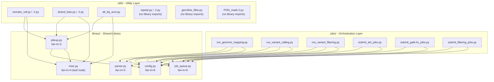
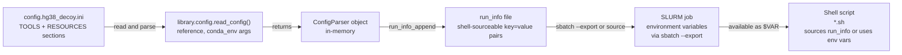

# Dependency Graph

## Local Import Dependency Graph

**DAG validation**: No circular dependencies detected. The graph is a strict Directed Acyclic Graph (DAG):
- `library/` has no imports from `jobs/` or `utils/`
- `utils/` has no imports from `jobs/`
- `jobs/` imports `library/` only
- `library/misc.py` has no project-internal imports (true leaf node)
- `utils/repeat.py`, `utils/germline_filter.py`, `utils/PON_mask.2.py` have no `library/` imports

---

## Fan-In Analysis

| Module | Fan-In | Direct Callers |
|---|---|---|
| `library/config.py` | 6 | `run_genome_mapping`, `run_variant_calling`, `run_variant_filtering`, `submit_aln_jobs`, `submit_gatk-hc_jobs`, `submit_filtering_jobs` + internally `library/pileup` |
| `library/job_queue.py` | 6 | `run_genome_mapping`, `run_variant_calling`, `run_variant_filtering`, `submit_aln_jobs`, `submit_gatk-hc_jobs`, `submit_filtering_jobs` |
| `library/misc.py` | 4 | `library/pileup`, `utils/somatic_vaf`, `utils/strand_bias`, `utils/alt_bq_sum` |
| `library/pileup.py` | 3 | `utils/somatic_vaf`, `utils/strand_bias`, `utils/alt_bq_sum` |
| `library/parser.py` | 3 | `run_genome_mapping`, `run_variant_calling`, `run_variant_filtering` |

**High-risk modules** (fan-in >= 3): Any interface change to `library/config.py` or `library/job_queue.py` requires updating 6 call sites. These modules have zero test coverage, making safe refactoring impossible without first writing characterization tests.

---

## Shell Script to Python Utility Invocation Map

Shell scripts in `jobs/variant_filtering/` invoke Python utility scripts via subprocess. This is the primary runtime dependency between Tier 2 (Bash) and Tier 3 (utilities).

| Shell Script | Python Utility Invoked | Invocation Pattern |
|---|---|---|
| `A.gnomAD_germline_filter.sh` | `utils/germline_filter.py` | `python germline_filter.py <vcf> <gnomad_vcf> <out>` |
| `C.VAF_filters*.sh` | `utils/somatic_vaf.py` | `python somatic_vaf.py <vcf> <bam> <ref> <out>` |
| `C.VAF_filters*.sh` | `utils/strand_bias.py` | `python strand_bias.py <vcf> <bam> <out>` |
| `C.VAF_filters*.sh` | `utils/alt_bq_sum.py` | `python alt_bq_sum.py <vcf> <bam> <out>` |
| `E.mayo_filters*.sh` | `utils/repeat.py` | `python repeat.py <vcf> <ref> <out>` |
| `F.PON_mask.sh` | `utils/PON_mask.2.py` | `python PON_mask.2.py <vcf> <pon_dir> <out>` |

**Note**: The `.2.py` versions have been consolidated into the main `.py` files with multiprocessing support via `-n` flag.

---

## External Tool Dependency Catalog

### Phase 1: Genome Mapping

| Tool | Version | Purpose | Invoked By |
|---|---|---|---|
| BWA | 0.7.x | Short-read alignment (MEM algorithm) | `aln_1.align_sort.sh` |
| samtools | 1.x | BAM sort, merge, index, FASTQ extraction | `aln_1` through `aln_2`, `post_1` |
| sambamba | 0.8.x | Parallel duplicate marking | `aln_1.align_sort.sh` (sort), `aln_3.markdup.sh` |
| picard | 2.x | MarkDuplicates, SplitSamByReadGroup | `aln_3.markdup.sh`, `pre_2.split_fastq_by_RG.sh` |
| GATK3 | 3.8.x | RealignerTargetCreator, IndelRealigner, BaseRecalibrator, PrintReads | `aln_4.indel_realign*.sh`, `aln_5.bqsr*.sh` |

### Phase 2: Variant Calling

| Tool | Version | Purpose | Invoked By |
|---|---|---|---|
| samtools | 1.x | BAM to CRAM conversion (`-C`) | `pre_2.bam2cram.sh` |
| GATK4 | 4.x | HaplotypeCaller (gVCF mode, -ERC GVCF) | `gatk-hc_1.call.sh` (array 1-24) |
| bcftools | 1.x | gVCF concatenation across chromosomes | `gatk-hc_2.concat_vcf.sh` |
| GATK4 | 4.x | VariantRecalibrator + ApplyVQSR (SNP and INDEL tranches) | `gatk-hc_3.vqsr.sh` |

### Phase 3: Variant Filtering

| Tool | Version | Purpose | Invoked By |
|---|---|---|---|
| bcftools | 1.x | VCF filtering, annotation, PASS selection | Multiple stages A-G |
| vt | — | Variant normalization and decomposition | Stage A/B preprocessing |
| CNVnator | 0.4.x | Copy number variant detection from BAM depth | `A.CNVnator_mk_root*.sh`, `D.CNVnator_genotype_filter.sh` |
| MosaicForecast | — | ML-based somatic mosaic variant classification | `E.MosaicForecast*.sh` |
| liftOver | — | Genomic coordinate conversion between genome builds | `F.PON_mask.sh` |
| bedtools | 2.x | Genomic interval intersection (PON masking) | `F.PON_mask.sh` |

---

## Python Package Dependencies (Conda Environment)

### Bioinformatics Packages

| Package | Purpose | Used By |
|---|---|---|
| `pysam` | BAM/CRAM/VCF Python API | `utils/germline_filter.py`, `utils/PON_mask.2.py` |
| `pyfaidx` | FASTA file indexing and random access | `utils/repeat.py` |
| `bwa` | Alignment tool (conda-managed binary) | `aln_1.align_sort.sh` |
| `samtools` | SAM/BAM manipulation binary | Multiple shell scripts |
| `sambamba` | Parallel duplicate marking binary | `aln_1`, `aln_3` |
| `gatk4` | GATK4 binary | Variant calling shell scripts |
| `bcftools` | VCF/BCF binary | Filtering shell scripts |
| `cnvnator` | CNV detection binary | Stage A/D shell scripts |

### Python Scientific Stack

| Package | Purpose | Used By |
|---|---|---|
| `scipy` | Binomial test (VAF), Fisher's exact test (strand bias) | `utils/somatic_vaf.py`, `utils/strand_bias.py` |
| `statsmodels` | Additional statistical tests | `utils/strand_bias.py` |
| `numpy` | Numerical arrays for statistical calculations | `utils/somatic_vaf.py`, `utils/strand_bias.py` |
| `pandas` | DataFrame-based PON position lookup | `utils/PON_mask.2.py` |
| `rpy2` | R integration for Poisson-based strand bias tests | `utils/strand_bias.py` |

### R Packages (via rpy2)

| R Package | Purpose |
|---|---|
| Base R `stats` | Poisson test for strand bias detection |

### Testing and Infrastructure

| Package | Purpose |
|---|---|
| `pytest` | Test framework (configured but no tests written) |
| `pytest-cov` | Coverage measurement |

---

## Configuration Dependency Chain

Tool binary paths and resource file paths from the INI config are propagated through the entire job chain, making every shell script free of hardcoded paths and portable across HPC installations that have different tool installations.
