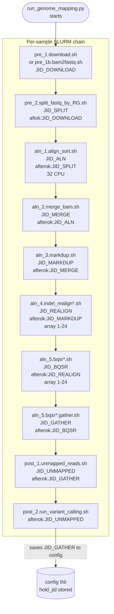
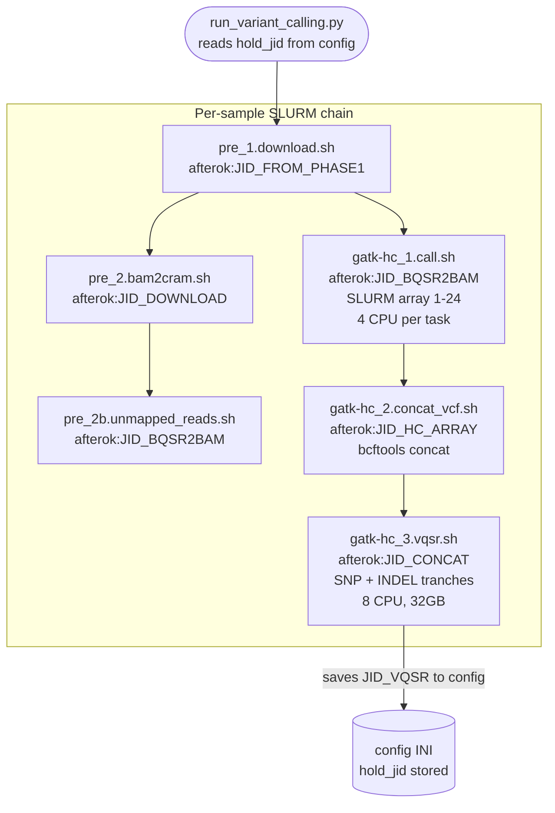
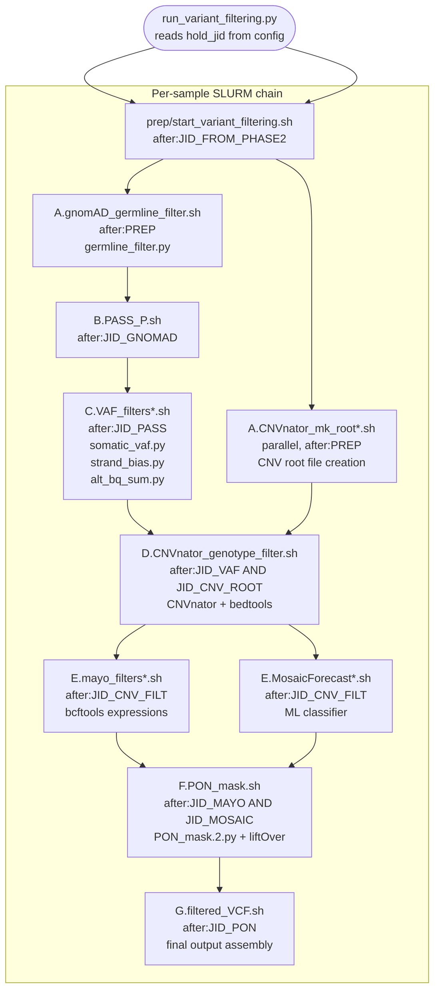

# Entry Points

## Primary Entry Points (Phase Orchestrators)

These three Python scripts are the canonical entry points for running the pipeline. Each is invoked by the researcher on an HPC login node and submits downstream SLURM jobs without requiring the script to remain alive.

---

### Phase 1: jobs/run_genome_mapping.py

**Purpose**: Orchestrate genome alignment from raw FASTQ/BAM/CRAM inputs through BQSR-corrected BAM output.

**Typical invocation**:

```bash
python jobs/run_genome_mapping.py \
    -q normal \
    -n somatic-pipeline \
    -f fastq \
    -r hg38_decoy \
    -p 2 \
    --sample-list samples.txt
```

**CLI argument table**:

| Argument | Short | Required | Type | Description |
|---|---|---|---|---|
| `--queue` | `-q` | Yes | str | SLURM partition/queue name (e.g., `normal`, `high`, `long`) |
| `--conda-env` | `-n` | Yes | str | Conda environment name to activate inside each SLURM job |
| `--align-fmt` | `-f` | Yes | str | Input format: `fastq`, `bam`, or `cram` |
| `--reference` | `-r` | Yes | str | Reference genome key matching a `config.<key>.ini` file |
| `--ploidy` | `-p` | Yes | int | Sample ploidy (2 for diploid; affects sex chromosome handling in Phase 2) |
| `--sample-list` | (positional) | Yes | path | Tab-separated sample manifest file |

**Job dependency chain**:



---

### Phase 2: jobs/run_variant_calling.py

**Purpose**: Orchestrate variant calling from BQSR BAMs through VQSR-recalibrated VCF output.

**Typical invocation**:

```bash
python jobs/run_variant_calling.py \
    -q normal \
    -n somatic-pipeline \
    -f cram \
    -r hg38_decoy \
    -p 2 \
    --sample-list samples.txt
```

**CLI argument table**: Same structure as Phase 1 (`-q`, `-n`, `-f`, `-r`, `-p`, `--sample-list`).

**Job dependency chain**:



---

### Phase 3: jobs/run_variant_filtering.py

**Purpose**: Orchestrate the multi-stage variant filtering pipeline (stages A-G) from raw VCF through the final filtered somatic variant VCF.

**Typical invocation**:

```bash
python jobs/run_variant_filtering.py \
    -q normal \
    -n somatic-pipeline \
    -f cram \
    -r hg38_decoy \
    -p 2 \
    --sample-list samples.txt
```

**CLI argument table**: Same structure as Phase 1 (`-q`, `-n`, `-f`, `-r`, `-p`, `--sample-list`).

**Job dependency chain**:



---

## Sample List Input Format

The `--sample-list` argument accepts a tab-separated values (TSV) file. The format varies by input type detected by `library/parser.filetype()`.

**FASTQ input** (paired-end):

```
sample_id       R1_path                                 R2_path
SAMPLE_001      /data/reads/sample001_R1.fastq.gz       /data/reads/sample001_R2.fastq.gz
SAMPLE_002      /data/reads/sample002_R1.fastq.gz       /data/reads/sample002_R2.fastq.gz
```

**BAM/CRAM input**:

```
sample_id       file_path
SAMPLE_001      /data/bams/sample001.bam
SAMPLE_002      /data/crams/sample002.cram
```

The `library/parser.sample_list()` function returns a `defaultdict` keyed by `sample_id`. The `library/parser.filetype()` function inspects the file extension of entries in the first data row to determine the format (`"fastq"`, `"bam"`, or `"cram"`).

---

## Helper Submission Scripts

These scripts provide fine-grained control for re-submitting specific pipeline steps without invoking the full phase orchestrator. They are the primary recovery mechanism after partial SLURM job failures.

| Script | Phase | Primary Use Case |
|---|---|---|
| `jobs/submit_aln_jobs.py` | 1 | Re-submit alignment jobs for one or more specific samples |
| `jobs/submit_aln_jobs.just_mapping.py` | 1 | Re-submit alignment only (skips download and preprocessing) |
| `jobs/submit_gatk-hc_jobs.py` | 2 | Re-submit HaplotypeCaller for specific samples or chromosome ranges |
| `jobs/submit_filtering_jobs.py` | 3 | Re-submit filtering from a specific stage (A-G) |

All helper scripts accept the same `-q`, `-n`, `-f`, `-r`, `-p`, `--sample-list` arguments as the primary entry points.

---

## Shell Script Stage Catalog

### Phase 1: jobs/genome_mapping/ - Naming Convention: `pre_N`, `aln_N`, `post_N`

| Script | Stage | Tools | Est. SLURM Resources |
|---|---|---|---|
| `pre_1.download.sh` | Download FASTQ | wget, rsync | 1 CPU, 4GB, 2h |
| `pre_1b.bam2fastq.sh` | BAM to FASTQ | samtools fastq, picard SamToFastq | 4 CPU, 8GB, 4h |
| `pre_2.split_fastq_by_RG.sh` | Split by read group | samtools, picard SplitSamByReadGroup | 4 CPU, 8GB, 2h |
| `aln_1.align_sort.sh` | Align + sort | bwa mem, sambamba sort | 32 CPU, 64GB, 24h |
| `aln_2.merge_bam.sh` | Merge per-RG BAMs | samtools merge | 4 CPU, 16GB, 4h |
| `aln_3.markdup.sh` | Mark duplicates (Picard) | picard MarkDuplicates | 8 CPU, 32GB, 8h |
| `aln_3.markdup_spark.sh` | Mark duplicates (Spark) | GATK4 MarkDuplicatesSpark | 16 CPU, 64GB, 6h |
| `aln_4.indel_realign*.sh` | Indel realignment | GATK3 RealignerTargetCreator + IndelRealigner | 4 CPU, 16GB, 12h |
| `aln_4.indel_realign*.array.sh` | Indel realignment (array) | GATK3 (array 1-24) | 4 CPU x 24 tasks |
| `aln_5.bqsr*.sh` | BQSR | GATK3 BaseRecalibrator + PrintReads | 8 CPU, 32GB, 12h |
| `aln_5.bqsr*.array.sh` | BQSR (array) | GATK3 (array 1-24) | 8 CPU x 24 tasks |
| `aln_5.bqsr*.gather.sh` | Gather BQSR reports | GATK3 GatherBqsrReports | 2 CPU, 8GB, 1h |
| `post_1.unmapped_reads.sh` | Extract unmapped reads | samtools view -f 4 | 4 CPU, 8GB, 2h |
| `post_2.run_variant_calling.sh` | Trigger Phase 2 | Python (calls run_variant_calling.py) | 1 CPU, 2GB, 0.5h |
| `prep/` | Repair helpers | Various preprocessing | Variable |

### Phase 2: jobs/variant_calling/ - Naming Convention: `pre_N`, `gatk-hc_N`

| Script | Stage | Tools | Est. SLURM Resources |
|---|---|---|---|
| `pre_1.download.sh` | Download BAMs | wget, rsync | 1 CPU, 4GB, 2h |
| `pre_2.bam2cram.sh` | BAM to CRAM | samtools view -C | 4 CPU, 8GB, 4h |
| `pre_2b.unmapped_reads.sh` | Extract unmapped reads | samtools view -f 4 | 4 CPU, 8GB, 2h |
| `pre_3.run_variant_calling.sh` | Phase trigger | Python | 1 CPU, 2GB, 0.5h |
| `gatk-hc_1.call.sh` | HaplotypeCaller | GATK4 HaplotypeCaller -ERC GVCF | 4 CPU, 16GB, 24h (array 1-24) |
| `gatk-hc_2.concat_vcf.sh` | Concat gVCFs | bcftools concat | 4 CPU, 8GB, 2h |
| `gatk-hc_3.vqsr.sh` | VQSR | GATK4 VariantRecalibrator + ApplyVQSR | 8 CPU, 32GB, 8h |

### Phase 3: jobs/variant_filtering/ - Naming Convention: Stage letters A-G

| Script | Stage | Tools / Utilities | Est. SLURM Resources |
|---|---|---|---|
| `prep/start_variant_filtering.sh` | Setup | Environment prep | 1 CPU, 2GB, 0.5h |
| `A.CNVnator_mk_root*.sh` | A (parallel track) | CNVnator | 4 CPU, 16GB, 8h |
| `A.gnomAD_germline_filter.sh` | A (main track) | bcftools, `germline_filter.py` | 4 CPU, 8GB, 4h |
| `B.PASS_P.sh` | B | bcftools view --apply-filters PASS | 2 CPU, 4GB, 1h |
| `C.VAF_filters*.sh` | C | `somatic_vaf.py`, `strand_bias.py`, `alt_bq_sum.py` | 8 CPU, 32GB, 12h |
| `D.CNVnator_genotype_filter.sh` | D | CNVnator genotype, bedtools intersect | 4 CPU, 8GB, 4h |
| `E.mayo_filters*.sh` | E (branch 1) | bcftools filter (strand_bias, repeat, alt_bq) | 4 CPU, 8GB, 4h |
| `E.MosaicForecast*.sh` | E (branch 2) | MosaicForecast ML pipeline | 8 CPU, 32GB, 12h |
| `F.PON_mask.sh` | F | `PON_mask.2.py`, liftOver, bedtools | 8 CPU, 32GB, 8h |
| `G.filtered_VCF.sh` | G | bcftools concat/merge | 4 CPU, 8GB, 2h |

---

## SLURM Job ID Dependency Mechanism

The cross-phase dependency mechanism relies on `library/config.py`:

1. Phase 1 orchestrator submits the final BQSR job and calls `save_hold_jid(fname, JID_BQSR)` to write the job ID into the INI config file.
2. Phase 2 orchestrator is invoked by the researcher (or via `post_2.run_variant_calling.sh`). It reads the stored JID via `run_info()` and submits all Phase 2 jobs with `-d afterok:JID_BQSR`.
3. Phase 2 repeats: saves `JID_VQSR` to config.
4. Phase 3 orchestrator reads `JID_VQSR` and submits Stage A with `-d afterok:JID_VQSR`.

This design means orchestrator Python scripts can exit immediately after submission. SLURM handles all execution ordering.
