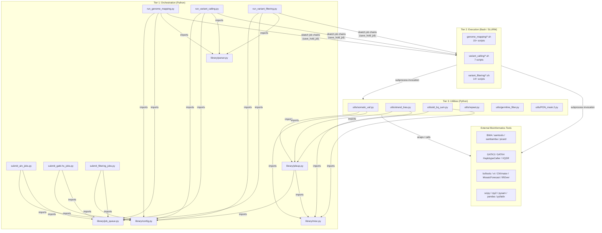
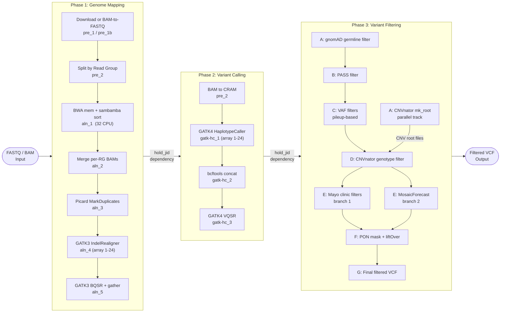

# Somatic Variant Pipeline - Architecture Overview

## Project Purpose

A production bioinformatics pipeline for somatic variant detection running on HPC clusters via SLURM. It processes raw sequencing data (FASTQ or BAM) through three sequential phases—genome mapping, variant calling, and variant filtering—to produce clinically interpretable filtered VCF files. Designed for multi-sample throughput with per-chromosome parallelization and support for five reference genome builds.

---

## Three-Tier Architecture

The shared `library/` package lives inside Tier 1 and is imported horizontally by all orchestration scripts and certain utilities. It is a pure dependency sink: it has no upward imports from `jobs/` or `utils/`.

---

## Three Pipeline Phases

---

## Technology Stack

| Layer | Technology | Purpose |
|---|---|---|
| Orchestration | Python 3 | Job submission logic, config loading, sample manifest parsing |
| Job Scheduler | SLURM (`sbatch`) | HPC cluster scheduling, array jobs (1-24), `-d afterok:JID` dependency chains |
| Execution | Bash 4+ | Atomic job units sourcing config and invoking bioinformatics tools |
| Conda | conda / mamba | Reproducible environment management (flexible + pinned variants) |
| Alignment | BWA mem, samtools, sambamba | Read alignment, coordinate sorting, BAM manipulation |
| Duplicate Marking | Picard MarkDuplicates | Optical and PCR duplicate removal |
| Indel Realignment | GATK3 IndelRealigner | Legacy realignment for indel accuracy (pre-GATK4 BQSR) |
| Base Quality Recal. | GATK3 BaseRecalibrator | BQSR scoring and application to BAM quality scores |
| Variant Calling | GATK4 HaplotypeCaller | Per-chromosome gVCF production in GVCF mode |
| VQSR | GATK4 VariantRecalibrator + ApplyVQSR | Variant quality score recalibration (SNP and INDEL tranches) |
| VCF Manipulation | bcftools, vt | Concatenation, normalization, decomposition |
| CNV Detection | CNVnator | Copy number variant root file generation and genotyping |
| Mosaic Detection | MosaicForecast | ML-based mosaic somatic variant scoring |
| Population Filter | gnomAD VCF | Germline contamination removal by allele frequency threshold |
| Panel of Normals | Custom PON + liftOver | Systematic artifact masking with coordinate liftover |
| Python Scientific | scipy, statsmodels, numpy, pandas | Statistical tests (binomial, Fisher, Poisson), data wrangling |
| R Integration | rpy2 | R-based statistical tests called from Python utilities |
| Pileup Streaming | pysam, `library/pileup.py` | Coroutine-based samtools mpileup wrapper for VAF/strand bias |
| FASTA Access | pyfaidx | Indexed FASTA random access for repeat detection |
| Reference Config | INI files (5 builds) | Genome-build-specific tool binary paths and resource file paths |

---

## Key Design Decisions and Trade-offs

### Decision 1: Python Orchestration + Bash Execution Separation

Python scripts handle job submission logic (dependency tracking, sample iteration, config parsing). Bash scripts manage bioinformatics tool invocation as atomic SLURM units.

- **Benefit**: Python gains access to the full `library/` abstraction layer; Bash scripts are portable and debuggable on the cluster without a Python runtime.
- **Trade-off**: Two languages to maintain; Bash scripts have no type safety and cannot be unit tested.

### Decision 2: SLURM Job Dependency Chains via `save_hold_jid`

`library/job_queue.py` wraps `sbatch` and writes returned job IDs to the sample INI config. Downstream jobs use `-d afterok:JID` to form implicit DAGs without an external workflow manager.

- **Benefit**: Orchestrator scripts exit immediately after submission; SLURM handles all ordering; no persistent coordinator process required.
- **Trade-off**: Tight SLURM coupling with no abstraction for LSF, PBS, or local execution; misnamed `GridEngineQueue` class.

### Decision 3: Per-Chromosome SLURM Array Jobs

GATK4 HaplotypeCaller and GATK3 indel realignment/BQSR are submitted as SLURM array jobs (indices 1–24) for chromosomal parallelization.

- **Benefit**: Approximately 24x speedup for the most compute-intensive phases.
- **Trade-off**: Requires a gather/concat step; complicates job ID dependency tracking; array size is hardcoded to 24.

### Decision 4: Coroutine-Based Pileup Streaming

`library/pileup.py` uses Python generator coroutines (via the `@coroutine` decorator from `library/misc.py`) to stream `samtools mpileup` output line-by-line.

- **Benefit**: O(1) memory for WGS-scale pileup; enables real-time per-position VAF and strand bias analysis.
- **Trade-off**: Coroutine-based code is unfamiliar to most developers; requires priming with `@coroutine` decorator.

### Decision 5: Five Parallel Reference Genome Config Files

Separate INI files for b37, hg19, hg38_v0, hg38_decoy, and hg38_no_alt allow the same codebase to run against any reference build by switching the `-r` flag.

- **Benefit**: Human-readable, self-contained per-build configuration; no runtime detection logic.
- **Trade-off**: Near-identical files with no template inheritance; a new tool path must be added to all 5 files.

### Decision 6: Unified Utilities with Optional Multiprocessing

Performance-critical utilities (`somatic_vaf.py`, `strand_bias.py`, `repeat.py`) support optional multiprocessing via `-n` (nproc) flag. The former `.2.py` variants have been consolidated into the main files.

- **Benefit**: Single source of truth per utility, backward-compatible (default `nproc=1`).
- **Trade-off**: Dual-file maintenance burden; no semantic versioning, changelog, or formal deprecation policy.

---

## Architecture Assessment

### Strengths

| Strength | Details |
|---|---|
| Clear three-tier layering | Orchestration, execution, and utility layers have well-defined responsibilities with no upward imports; `library/` is a pure dependency sink |
| Reference genome flexibility | 5 INI configs cover b37, hg19, hg38 variants with no code changes required; `{ENVDIR}` and `{PIPEHOME}` substitution makes configs portable across HPC installations |
| HPC-native distributed execution | Per-chromosome SLURM array jobs (1-24) saturate cluster resources for the two most compute-intensive steps; dependency chains enforce ordering automatically |
| Memory-efficient streaming | Coroutine-based pileup pipeline in `library/pileup.py` processes WGS pileup data in O(1) memory using generator-based streaming |
| Modular filtering stages | Stages A-G are independently replaceable shell scripts; the two parallel E branches (mayo vs. MosaicForecast) allow algorithm substitution without disrupting the chain |
| Cross-phase job independence | `save_hold_jid` / `hold_jid` mechanism allows phases to be submitted minutes or days apart; the scheduler enforces execution ordering |
| Conda reproducibility | Both `environment.yml` (flexible) and `environment_frozen.yml` (pinned) are provided, supporting both development and reproducible production runs |

### Weaknesses

| Weakness | Impact |
|---|---|
| Zero test coverage | `tests/` directory is empty; no unit, integration, or characterization tests; any refactoring creates unbounded regression risk; CI validation is impossible |
| Config duplication | 5 near-identical INI files share no base template or inheritance mechanism; changes must be applied manually to all 5 files |
| Version ambiguity | `.py` vs `.2.py` naming without a changelog, deprecation policy, or semantic versioning; unclear which version is canonical |
| Tight SLURM coupling | `GridEngineQueue` class is hardcoded to `sbatch`/`squeue` (misnamed as GridEngine); no scheduler-agnostic abstraction; pipeline cannot run locally for testing |
| `pipeline/` directory absent | Planned modularization directory does not exist; new contributors may search for non-existent modules |
| No structured logging | Shell scripts use `echo` to stdout; no log aggregation, severity levels, or structured format; difficult to monitor large batch runs |
| Missing exit code propagation | Shell scripts lack comprehensive error trapping; SLURM job failures may silently propagate as corrupted intermediate files rather than job failures |
